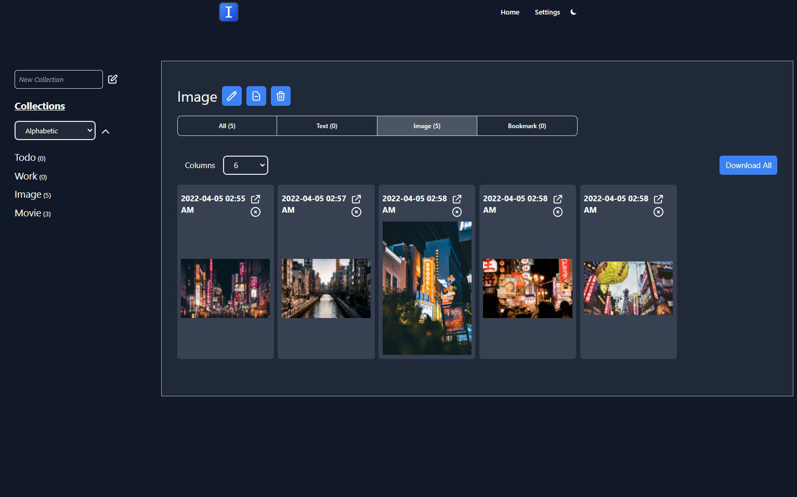

# Addy - A web extension for saving content quickly

Using [Chrome Extension Boilerplate with React 17 and Webpack 5](https://github.com/lxieyang/chrome-extension-boilerplate-react)

## Introduction

Maybe sometime you just keep the tab for some keywords you want , but copy and paste these keywords to your Note-Taking app is slow and easy to losing focus after doing the process for serval times.

This browser extensions creates a quick method to categorize and save the keywords that you want to a temporary area for later use, and you can focus on killing your tabs.

## Features

- Cross browsers Support ( Firefox / Chrome )
- Works with Chrome Incognito Mode and Firefox Private Browsing
- Save Image
- Import / Export Data
- Dark Mode
- Sync with Google Drive / AWS S3
- Auto Sync

## Download

## FAQ

_Why not just use the web clipper that come with Note-Taking Apps?_

Many web clipper required you to login to your Note-Taking app account. It means you cannot use them in Incognito Mode / Private Browsing or other profiles / browsers that you don't want to login to your account. We hope this tool can works without login.

## Support

## Privacy Policy

[Privacy Policy](https://addy.insanelyones.com/privacy-policy)
